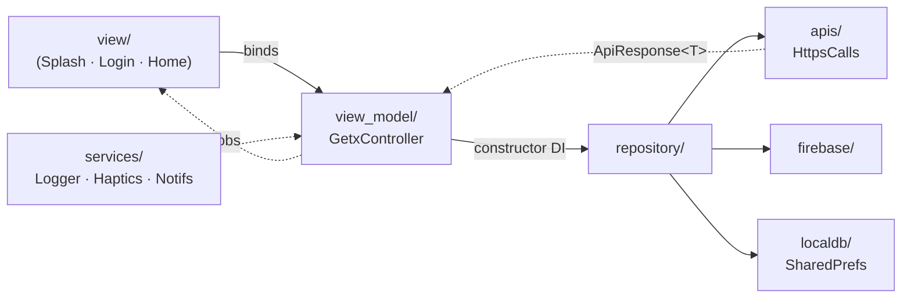

<!-- LAYERX — the tea is architecture. -->

<p align="center">

```
    ██╗      █████╗ ██╗   ██╗███████╗██████╗ ██╗  ██╗
    ██║     ██╔══██╗╚██╗ ██╔╝██╔════╝██╔══██╗╚██╗██╔╝
    ██║     ███████║ ╚████╔╝ █████╗  ██████╔╝ ╚███╔╝
    ██║     ██╔══██║  ╚██╔╝  ██╔══╝  ██╔══██╗ ██╔██╗
    ███████╗██║  ██║   ██║   ███████╗██║  ██║██╔╝ ██╗
    ╚══════╝╚═╝  ╚═╝   ╚═╝   ╚══════╝╚═╝  ╚═╝╚═╝  ╚═╝
         one command. a whole architecture. no cap.
```

</p>

<p align="center">
  <b>◆ Flutter code generator that scaffolds a full MVVM + GetX app in one command ◆</b><br/>
  <sub>routing wired · DI wired · design system dropped in · deps installed · natively patched · <code>dart format</code>ted</sub>
</p>

<p align="center">
  <a href="https://pub.dev/packages/layerx_generator"></a>
  <a href="https://github.com/the-bughex-code/flutter_layerX/blob/main/LICENSE"></a>
  
  
  <br/>
  
  
  
  
</p>

---

## `the tea` ☕

Real talk: you know the ritual. New Flutter project → 45 minutes wiring GetX, foldering `mvvm/`, copy-pasting your `HttpsCalls` from that *one* old repo, re-styling the same button for the 900th time, forgetting the notification permission in the manifest again. Every. Single. Time.

**LayerX does all of that in one command.** It's a CLI that writes a real, opinionated, production-shaped architecture into your `lib/` — not a runtime dependency you drag around, just clean code that's *yours* the second it lands.

> it's giving "senior dev already set up the repo before standup" energy — except the senior dev is a `dart pub global` command and it took 30 seconds.

You run it. It ships MVVM + GetX, a full design system, a pooled networking layer, a logger that actually slaps, a Splash → Login → Home demo flow, and it patches your native permissions. Then it runs `dart format` so the diff is clean on arrival. We don't miss.

---

## ◆ quick start (the one-command flex)

```bash
# 1 — put the CLI on your machine (once, globally)
dart pub global activate layerx_generator

# 2 — cd into your Flutter project and let it cook
layerx enable
```

That's the whole thing. `layerx enable` installs every dependency, generates the architecture into `lib/app/`, wires routing + DI, drops the demo flow, formats the output, and patches native permissions. **Ship it fr.**

<details>
<summary><b>more knobs (for the control freaks — respectfully)</b></summary>

```bash
layerx enable --path .          # target an explicit project directory
layerx enable --no-deps         # generate the code, skip the dependency install
                                # (clutch if you manage pubspec yourself)

# legacy entry point — still works, no judgment
dart run layerx_generator --path .
```

> heads up: point it at a **fresh** Flutter project. It scaffolds `lib/app/` — it's not here to fight your existing 40-file `lib/`.

</details>

---

## ◆ what you actually get

| you wanted | LayerX hands you |
|---|---|
| **Architecture** | MVVM split into `model / view / view_model`, GetX for state + nav + DI. built different. |
| **Design system** | `custom_widgets/` — buttons, inputs, snackbars, animation wrappers, dialogs. all animated, all yours. |
| **Networking** | pooled `HttpsCalls` client with retries, backoff, cancellation, request de-dup + a typed `ApiResponse<T>`. |
| **Repositories** | `auth_repository`, `apis/`, `firebase/`, `localdb/` — injected into controllers via constructor. clean. |
| **Routing** | one file. `AppRoutes` + `AppPages` + `GetPage` + `BindingsBuilder`. no separate binding files cluttering the tree. |
| **The console** | `LoggerService` — boot banner, colored/emoji tags, pretty JSON, timing, `kDebugMode`-gated. |
| **Native setup** | AndroidManifest + iOS Info.plist auto-patched for internet, notifications, alarms, vibration & location. |
| **Demo flow** | Splash → Login → Home, working out of the box. main character energy from file one. |

And the whole thing lands passing `flutter analyze` (**"No issues found!"**), passing `flutter test`, `dart format`-clean, 100% null-safe, with a **GitHub Actions CI** already wired. lowkey we did the homework for you.

---

## ◆ auto-installed deps (resolved for you, latest compatible)

You don't pick versions. LayerX resolves the newest set that actually plays nice together and drops them in your `pubspec.yaml`.

```yaml
# ── state · ui · motion ──────────────────────────────
get                     # state + navigation + DI, the GetX way
flutter_screenutil      # responsive sizing (.h / .w / .sp everywhere)
flutter_animate         # declarative animation, chef's kiss
google_fonts            # Inter / Rubik / Sarabun / SF Pro on tap

# ── data · io ────────────────────────────────────────
http                    # under the pooled HttpsCalls hood
shared_preferences      # local key-value, the localdb layer
intl                    # dates / numbers / i18n
logger                  # powering LoggerService

# ── platform ─────────────────────────────────────────
permission_handler      # runtime permissions, handled
# + notifications + location stack, wired and ready
```

> no cap: you never open a version table. it just resolves. ✅

---

## ◆ folder structure (the vibes are organized)

```
lib/
└── app/
    ├── app_widget.dart              # root MaterialApp, GetX-flavored
    ├── config/
    │   └── app_routes.dart          # AppRoutes + AppPages + GetPage + BindingsBuilder
    ├── mvvm/
    │   ├── model/                   # your data shapes
    │   ├── view/                    # the screens (Splash · Login · Home)
    │   └── view_model/              # GetxControllers, constructor-injected repos
    ├── repository/
    │   ├── auth_repository.dart     # injected into controllers
    │   ├── apis/                    # remote sources (HttpsCalls)
    │   ├── firebase/                # firebase-backed sources
    │   └── localdb/                 # shared_preferences layer
    ├── services/
    │   ├── notifications/           # notification plumbing
    │   └── ...                      # HttpsCalls · LoggerService · HapticService
    └── custom_widgets/
        ├── buttons/                 # AppButton
        ├── inputs/                  # AppTextField
        ├── snackbars/               # 'msg'.showSuccess() & friends
        ├── animations/              # FadeSlideIn · SpringIn · PressableScale · ...
        └── dialogs/                 # your dialog kit
```



> separation of concerns, but make it fashion. we don't do spaghetti in this house.

---

## ◆ the design system (custom_widgets/)

### AppButton — a button with main character energy

```dart
AppButton(
  label: 'Continue',
  onPressed: () => controller.submit(),
  isLoading: controller.isLoading.value,  // spinner state, handled
  gradient: const LinearGradient(          // optional gradient fill
    colors: [Color(0xff2D9BFF), Color(0xff5B7FFF)],
  ),
  suffixIcon: Icons.arrow_forward,
  // press animation + haptics baked in — it *feels* expensive
)
```

Press-scale animation, optional gradient, leading/trailing icons, a loading state, and haptic feedback on tap. lowkey does more than your last 3 custom buttons combined.

### AppTextField — validation that isn't an afterthought

```dart
AppTextField(
  label: 'Email',
  isRequired: true,                        // shows the required marker
  prefixIcon: const Icon(Icons.mail_outline),
  validator: (v) => v!.isEmpty ? 'we need this one' : null,
  // focus styles, error styles, soft shadow — all there
)
```

Built-in validation, required marker, prefix/suffix slots, distinct focus + error states, and a soft shadow. it's giving *polished*.

### Snackbars — one string, one method, done

```dart
'Saved to the cloud'.showSuccess();
'Something went sideways'.showError();
'Heads up, bestie'.showWarning();
```

Extension methods, straight on `String`. Dark-glass aesthetic, zero boilerplate. no context passing, no `ScaffoldMessenger.of(context)` gymnastics. highkey the best part.

### HapticService — feedback that feels intentional

```dart
HapticService.light();      HapticService.medium();
HapticService.heavy();      HapticService.selection();
HapticService.success();    HapticService.error();
```

### Animation wrappers — wrap it and it moves

```dart
FadeSlideIn(child: HeroCard());          // enter with grace
SpringIn(child: Badge());                // bouncy entrance
PressableScale(child: Tile());           // press-to-shrink
FloatingEffect(child: Avatar());         // gentle idle float
StaggeredColumn(children: [...]);        // cascade, item by item
```

### Typography + padding extensions — the small stuff that adds up

```dart
Text('LayerX', style: AppTextStyles.displayLarge); // Inter · Rubik · Sarabun · SF Pro

// stop building SizedBox walls. padding extensions >>>
someWidget.paddingBottom(24.h);            // instead of a SizedBox sandwich
```

> we replaced `SizedBox(height: 24)` with `.paddingBottom(24.h)` and honestly? healed something in us.

---

## ◆ networking — HttpsCalls (the pooled one)

Not a naked `http.get`. A **pooled client** doing the grown-up stuff: automatic retries with backoff, in-flight cancellation, and request de-duplication (fire the same call twice, it won't double-hit your server). Everything comes back in a typed envelope.

```dart
// inside a repository — controllers never touch the network directly
final response = await _httpsCalls.getApiHits('users/me');
final result = await ApiResponseHandler.process(
  response,
  'users/me',
  UserDto.fromJson,
);

if (result.success == true) {
  use(result.data);                                  // typed UserDto, no cap
} else {
  (result.message ?? 'Something went sideways').showError();
}
```

> retries, backoff, cancel, de-dup — the boring reliability stuff, already handled. built different.

---

## ◆ the console (LoggerService) — logs that actually slap

`kDebugMode`-gated, so it's **silent in release**. In debug it's a whole experience: a boot banner, colored + emoji-tagged lines, request/response logging, pretty-printed JSON, section dividers, and execution timing.

```dart
LoggerService.banner(name: AppConfig.appName, env: 'debug');
LoggerService.request('POST', 'auth/login');
LoggerService.response(200, 'auth/login', body: data, elapsed: elapsed);
LoggerService.s('Logged in');                 // ✅ success line
LoggerService.json(session, label: 'SESSION'); // 🧾 pretty JSON
```

…lands in your console like:

```text
┌───────────────────────────────────────────────────────────
│ 16:27:08.901 (+0:00:00.003)
├┄┄┄┄┄┄┄┄┄┄┄┄┄┄┄┄┄┄┄┄┄┄┄┄┄┄┄┄┄┄┄┄┄┄┄┄┄┄┄┄┄┄┄┄┄┄┄┄┄┄┄┄
│ 🧱  LayerX  •  v2.1.0  •  DEBUG
│ ✨  Clean architecture · GetX · zero boilerplate
│ 🟢  Console ready — happy shipping!
└───────────────────────────────────────────────────────────
│ 📤 POST  auth/login
│ ✅ ← 200  auth/login • 613ms
│ 📦 { "token": "ey...", "name": "demo" }
└───────────────────────────────────────────────────────────
```

> **and it never logs your auth token.** we said clean architecture, we meant *clean*. your secrets stay secret, on god. 🔒

---

## ◆ native setup (auto-patched)

`layerx enable` reaches into your platform manifests so you don't forget the one permission that ships a broken build.

**Android** — `AndroidManifest.xml` gets:

```xml
INTERNET · POST_NOTIFICATIONS · VIBRATE · WAKE_LOCK
RECEIVE_BOOT_COMPLETED · SCHEDULE_EXACT_ALARM
ACCESS_FINE_LOCATION · ACCESS_COARSE_LOCATION
```

**iOS** — `Info.plist` gets:

```xml
NSLocationWhenInUseUsageDescription
UIBackgroundModes → remote-notification
```

> ⚠️ **you still bring your own Firebase.** Drop in your `google-services.json` (Android) and `GoogleService-Info.plist` (iOS). LayerX wires the structure — it can't wire your secrets, and it's not gonna ask for them.

---

## ◆ vibe check ✅

Every box a real project should tick, ticked before you touch a line:

```text
[✔] flutter analyze  →  "No issues found!"      · squeaky clean
[✔] flutter test     →  passing                 · green from birth
[✔] dart format      →  already formatted        · diff arrives tidy
[✔] null safety      →  100%                      · sound, no cope
[✔] CI               →  GitHub Actions included   · pushes get checked
[✔] platforms        →  6 (mobile · web · desktop)
```

six platforms, zero warnings, CI on arrival. we don't do "works on my machine" here.

---

## ◆ FAQ

<details>
<summary><b>Is LayerX a dependency I ship in my app?</b></summary>

Nope. It's a **dev-time CLI code generator**. It writes real Dart into your `lib/app/` and then it's out of your life — the generated code is 100% yours to edit, refactor, delete, whatever. Nothing from `layerx_generator` rides along in your release build.
</details>

<details>
<summary><b>Existing project or fresh one?</b></summary>

Point it at a **fresh** Flutter project for the smoothest run. It scaffolds a full `lib/app/` tree — on a project that already has a big `lib/`, you'll want to review before overwriting. lowkey just start clean.
</details>

<details>
<summary><b>I don't want it touching my pubspec / picking versions.</b></summary>

`layerx enable --no-deps` — generates every file, installs nothing. You own the dependency list. Respectfully, the control is yours.
</details>

<details>
<summary><b>Does it set up Firebase for me?</b></summary>

It builds the `repository/firebase/` structure and patches native permissions, but you supply your own `google-services.json` / `GoogleService-Info.plist`. Your keys, your rules — we're not holding those.
</details>

<details>
<summary><b>Why GetX and not [my preferred state manager]?</b></summary>

LayerX is **opinionated on purpose** — one command can't be a choose-your-own-adventure. GetX gives state + routing + DI in one lean package, which is what makes the "one command, done" promise land. It's a take, and we're taking it. 💅
</details>

<details>
<summary><b>Will it run <code>dart format</code> on the output?</b></summary>

Yes — the generated code lands already formatted, so your first commit diff is clean. no surprise 400-line reformat PR later. we move different.
</details>

<details>
<summary><b>The legacy command still works, right?</b></summary>

`dart run layerx_generator --path .` — still supported. Same energy, older door.
</details>

---

## ◆ requirements

| thing | version |
|---|---|
| Flutter | `>= 3.44` |
| Dart | `>= 3.8` |
| Platforms | Android · iOS · Web · macOS · Windows · Linux |

---

## ◆ contributing

Issues and PRs welcome over at **[the-bughex-code/flutter_layerX](https://github.com/the-bughex-code/flutter_layerX)**. Bugs, ideas, "have you considered" — bring it. If it makes the one-command experience cleaner, we're listening. 👀

---

## ◆ license

**MIT.** Do your thing — build, ship, remix, profit. Just keep the notice. See [LICENSE](https://github.com/the-bughex-code/flutter_layerX/blob/main/LICENSE).

---

<p align="center">
  <sub><b>LAYERX</b> · <code>layerx_generator</code> v2.1.0 · MIT · made by <a href="https://github.com/the-bughex-code">the-bughex-code</a></sub><br/>
  <sub><i>one command. a whole architecture. now go build something. ◆</i></sub>
</p>
