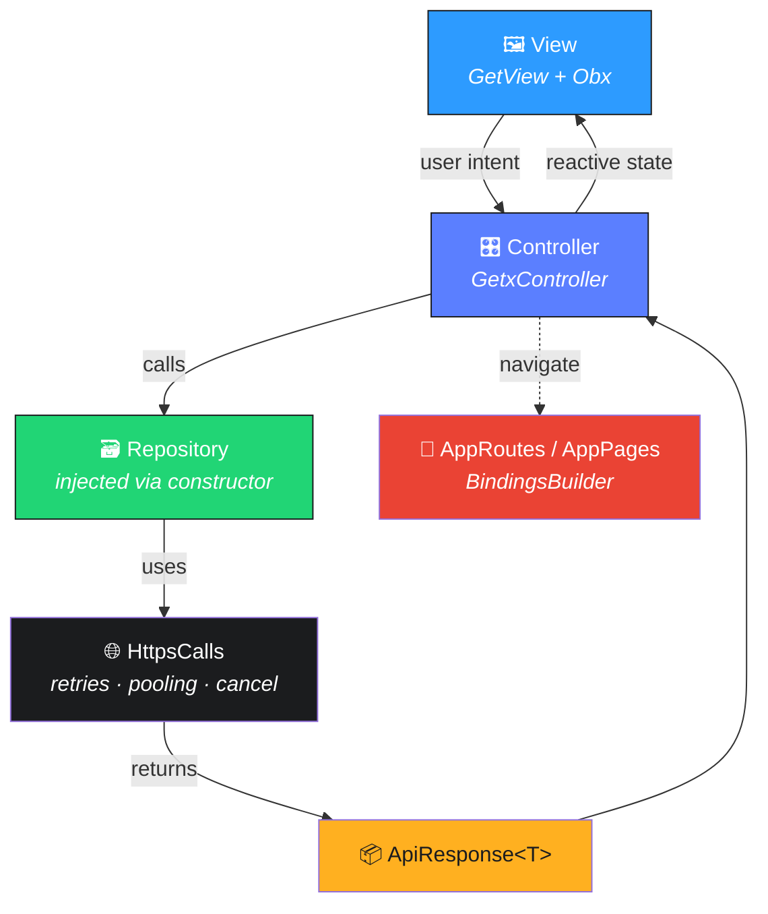

<p align="center">
  
</p>

<h1 align="center">◆ LayerX Generator</h1>

<p align="center">
  <b>Your Flutter architecture — scaffolded, wired, and error-free in one command.</b><br/>
  MVVM · GetX · resilient networking · a real design system · a working demo.<br/>
  <sub>Spend your first hour building features, not folders.</sub>
</p>

<p align="center">
  <a href="https://pub.dev/packages/layerx_generator"></a>
  <a href="https://pub.dev/packages/layerx_generator/score"></a>
  <a href="https://pub.dev/packages/layerx_generator/score"></a>
  
  
  
  
  
</p>

<p align="center">
  <i>“Ship bugs? We don't.”&nbsp;&nbsp;·&nbsp;&nbsp;“Null today. Null tomorrow. Null never.”&nbsp;&nbsp;·&nbsp;&nbsp;“Coffee in. Features out.”</i>
</p>

---

## ◆ Sixty-second start

```sh
dart pub global activate layerx_generator   # once
layerx enable                               # in your project root
flutter run                                 # ship it ☕
```

> **`layerx enable`** installs every dependency, scaffolds a clean `lib/app/`,
> wires routing + DI, drops in a Splash → Login → Home demo, and even runs
> `dart format` on the result. No manual fixes. No missing packages. No red squiggles.

---

## ◆ What's in the box

| | Feature | You get |
|---|---|---|
| 🧩 | **MVVM + GetX** | Views, controllers, models, repositories — routing & DI pre-wired |
| 📦 | **Auto dependencies** | GetX, ScreenUtil, `flutter_animate`, Google Fonts, `logger`, `http`, `intl`, prefs, permissions, notifications — latest compatible, resolved for you |
| 🎨 | **Design system** | `AppButton`, `AppTextField`, extension snackbars, haptics, animation wrappers, responsive `AppTextStyles` |
| 🌐 | **Networking** | Pooled `http` client with retries, backoff, cancellation & request de-duplication |
| 🖥️ | **Dev console** | Colored, emoji-tagged logs with request/response, pretty JSON & timing |
| 🚦 | **Working demo** | Splash → Login → Home with a constructor-injected `AuthRepository` |
| ✅ | **Error-free** | `flutter analyze` → *No issues found!* · `flutter test` → *All tests passed!* |

---

## ◆ Before &amp; after

<table>
<tr><th>Without LayerX</th><th>With LayerX</th></tr>
<tr>
<td>

- Hours of boilerplate before feature #1
- “Which folder does this go in?” 🤔
- Re-writing a networking layer *again*
- Warnings on a brand-new project
- Bikeshedding button &amp; snackbar styles

</td>
<td>

- One command → a complete architecture
- Opinionated, consistent structure
- Battle-tested `HttpsCalls` included
- **Zero** analyzer issues out of the box
- A design system that just works ✨

</td>
</tr>
</table>

---

## ◆ Fun facts

> From taking this package production-grade:

- 🧹 **~180 → 0** analyzer errors erased on a fresh project
- 🐛 **4** silent API-drift bugs caught by real builds (not vibes)
- 🔍 **15** review findings hunted down across 3 adversarial passes
- ⏱️ **1** command replaces an afternoon of setup
- 🟢 **100%** null-safe · **0** `TODO`s shipped

---

## ◆ Install

**Global (recommended)** — gives you the `layerx` command everywhere:

```sh
dart pub global activate layerx_generator
```

**Or as a dev dependency:**

```yaml
dev_dependencies:
  layerx_generator: ^2.1.0
```

---

## ◆ Usage

```sh
layerx enable                # generate into the current project
layerx enable --path .       # target a specific directory
layerx enable --no-deps      # generate files, skip dependency install
```

<details>
<summary><b>Prefer not to install globally?</b></summary>

```sh
dart run layerx_generator --path .
```

Same behaviour, zero global state.
</details>

**Programmatic:**

```dart
import 'package:layerx_generator/layerx_generator.dart';
import 'dart:io';

Future<void> main() async {
  await LayerXGenerator(Directory.current.path).generate();
}
```

---

## ◆ Supported platforms

| Android | iOS | Web | macOS | Windows | Linux |
|:---:|:---:|:---:|:---:|:---:|:---:|
| ✅ | ✅ | ✅ | ✅ | ✅ | ✅ |

> Requires **Flutter ≥ 3.44** · **Dart ≥ 3.8**.

---

## ◆ Architecture



Data flows one way — **View → Controller → Repository → Network** — and state flows
back reactively. Controllers own the logic, views stay thin, and only repositories
touch the network.

---

## ◆ Folder structure

```text
lib/app/
├── app_widget.dart              # ScreenUtil + GetMaterialApp
├── config/                      # colors · strings · routes · text styles · urls · utils
├── mvvm/
│   ├── model/                   # api_response · login_request/response
│   ├── view/                    # splash · login · home
│   └── view_model/              # splash · login · home controllers
├── repository/
│   ├── auth_repository.dart     # login() → ApiResponse<LoginResponseModel>
│   ├── apis/                    # data_repository.dart
│   ├── firebase/                # your Firestore/RTDB/Storage sources
│   └── localdb/                 # your Hive/Isar/sqflite sources
├── services/                    # logger · haptics · prefs · http · json · location
│   └── notifications/           # FCM + local notifications
└── custom_widgets/
    ├── buttons/ · inputs/ · snackbars/ · animations/ · dialogs/
```

---

## ◆ Design system

```dart
// Buttons — press animation, optional gradient, icons, loading, haptics
AppButton(label: 'Sign In', onPressed: controller.login, isLoading: true);

// Inputs — validation, required marker, prefix/suffix, focus & error styles
AppTextField(label: 'Email', isRequired: true, validator: controller.validateEmail);

// Snackbars — an extension on String
'Login successful'.showSuccess();
'Please try again'.showError();

// Haptics — centralized intensities
HapticService.success();

// Typography — never write a raw TextStyle in a view again
Text('Welcome', style: AppTextStyles.displayLarge);

// Spacing — use the generated padding extensions instead of SizedBox
myWidget.paddingBottom(24.h);

// Animations — drop-in wrappers
FadeSlideIn(child: card);   SpringIn(child: logo);   StaggeredColumn(children: rows);
```

---

## ◆ Routing (bindings live in routes — no binding files)

```dart
GetPage(
  name: AppRoutes.loginView,
  page: () => const LoginView(),
  binding: BindingsBuilder(() {
    Get.lazyPut<AuthRepository>(() => AuthRepository());
    Get.lazyPut<LoginController>(() => LoginController(Get.find<AuthRepository>()));
  }),
);
```

---

## ◆ The console

Call it once from `main()`:

```dart
LoggerService.banner(name: AppConfig.appName, env: 'debug');
```

…then log like a pro:

```dart
LoggerService.divider('AUTH FLOW');
LoggerService.request('POST', 'auth/login', body: {'email': email});
LoggerService.response(200, 'auth/login', body: data, elapsed: elapsed);
LoggerService.s('Logged in as $name');            // ✅ success
LoggerService.json(session, label: 'SESSION');     // 🧾 pretty JSON
LoggerService.hint('Wire your real endpoint');     // 💡 actionable hint
final u = await LoggerService.timed('fetchUser', () => api.getUser());  // ⏱️
```

```text
┌──────────────────────────────────────────────────────────
│ 16:27:08.901 (+0:00:00.003)
├┄┄┄┄┄┄┄┄┄┄┄┄┄┄┄┄┄┄┄┄┄┄┄┄┄┄┄┄┄┄┄┄┄┄┄┄┄┄┄┄┄┄┄┄┄┄┄┄┄┄┄┄┄┄┄┄
│ 🧱  LayerX  •  v2.1.0  •  DEBUG
│ ✨  Clean architecture · GetX · zero boilerplate
│ 🟢  Console ready — happy shipping!
└──────────────────────────────────────────────────────────
│ ✅ ← 200  auth/login • 613ms
│ 📦 { "token": "ey...", "name": "demo" }
└──────────────────────────────────────────────────────────
```

> Every line is gated behind `kDebugMode` — **silent in release**, and it never
> echoes secrets like your auth token. 🔐

---

## ◆ Configure &amp; customize

| Want to… | Do this |
|---|---|
| Change the font | `AppTextStyles.fontFamily = AppFontFamily.rubik;` |
| Re-theme colors | Edit tokens in `config/app_colors.dart` |
| Point at your API | Set `AppUrls.baseAPIURL` |
| Go live on auth | Replace the demo block in `AuthRepository.login()` |
| Add a screen | Add a `view/` + `view_model/` pair and a `GetPage` |

---

## ◆ FAQ

<details>
<summary><b>Does it overwrite my existing code?</b></summary>

It scaffolds `lib/app/`, rewrites `lib/main.dart` and `test/widget_test.dart`, and
adds missing dependencies. Run it on a fresh project (or a branch) for the cleanest result.
</details>

<details>
<summary><b>Why are firebase_messaging / geolocator included?</b></summary>

LayerX ships a notification + location stack, so those are added to keep everything
compiling. Want a leaner default? An opt-in flag is on the roadmap — open an issue.
</details>

<details>
<summary><b>Can I use it without installing globally?</b></summary>

Yes — <code>dart run layerx_generator --path .</code> works identically.
</details>

---

## ◆ Troubleshooting

| Symptom | Fix |
|---|---|
| `flutter: command not found` during enable | Ensure Flutter is on your `PATH`; LayerX falls back to writing `pubspec.yaml` so you can `flutter pub get` manually |
| Google Fonts not showing in tests | `GoogleFonts.config.allowRuntimeFetching = false;` in `setUpAll` |
| Notifications need setup | Uncomment `Firebase.initializeApp()` + `NotificationService.initialize()` in `main.dart` and add the native permissions |

---

## ◆ Verified error-free

Every release is validated on a freshly generated project:

```sh
flutter pub get     # ✔
flutter analyze     # No issues found!
flutter test        # All tests passed!
```

---

## ◆ Roadmap

- [ ] `--with-notifications` opt-in flag for the Firebase/location stack
- [ ] Native permission patcher (Android manifest + iOS Info.plist)
- [ ] Optional theme presets
- [ ] `layerx add screen <name>` sub-generator

---

## ◆ Contributing

PRs and issues welcome at
[the-bughex-code/flutter_layerX](https://github.com/the-bughex-code/flutter_layerX).
Run `dart analyze` and `dart test` before opening a PR.

## ◆ Versioning &amp; changelog

Semantic Versioning. See [CHANGELOG.md](CHANGELOG.md) for release notes.

## ◆ License

[MIT](LICENSE) © the-bughex-code

## ◆ Acknowledgements

Standing on the shoulders of [GetX](https://pub.dev/packages/get),
[flutter_screenutil](https://pub.dev/packages/flutter_screenutil),
[flutter_animate](https://pub.dev/packages/flutter_animate),
[google_fonts](https://pub.dev/packages/google_fonts) and
[logger](https://pub.dev/packages/logger).

<p align="center"><sub>Made with clean architecture, not chaos. ◆</sub></p>
